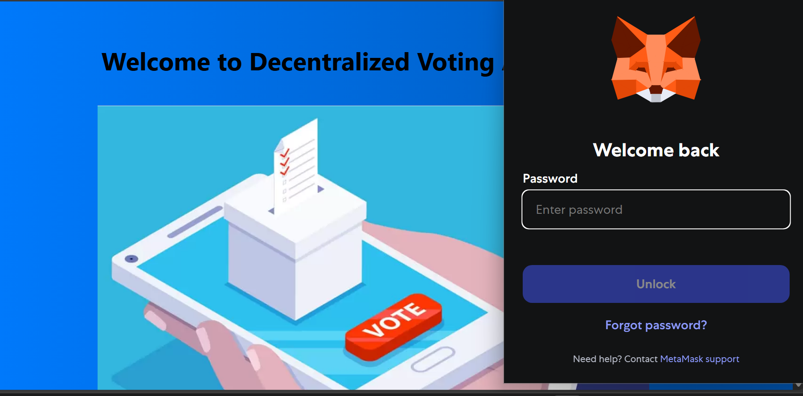
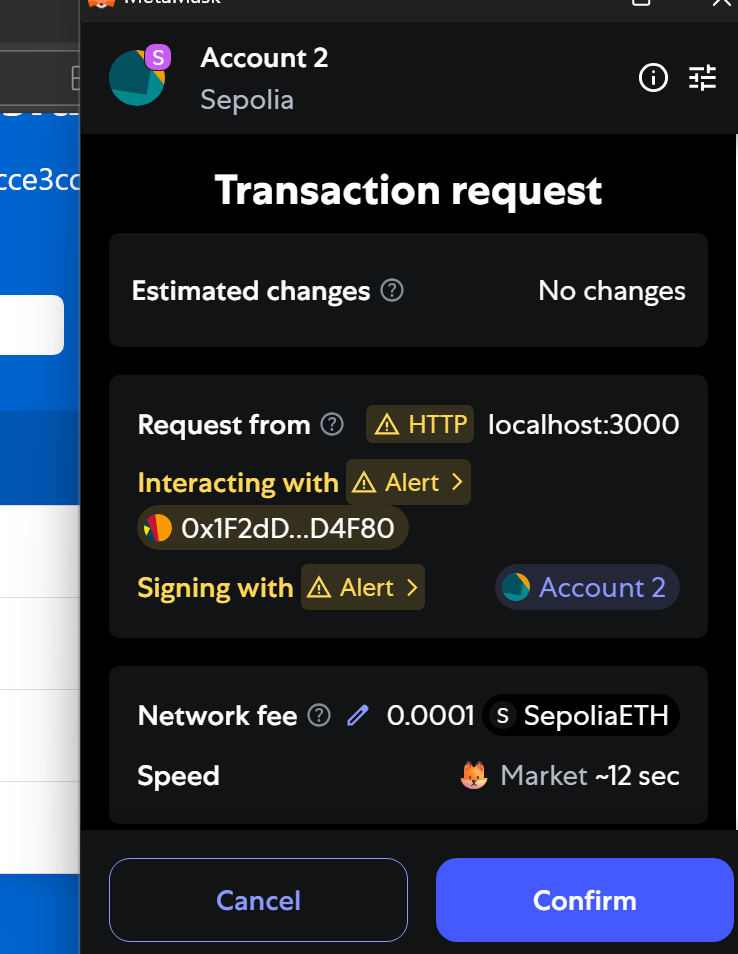
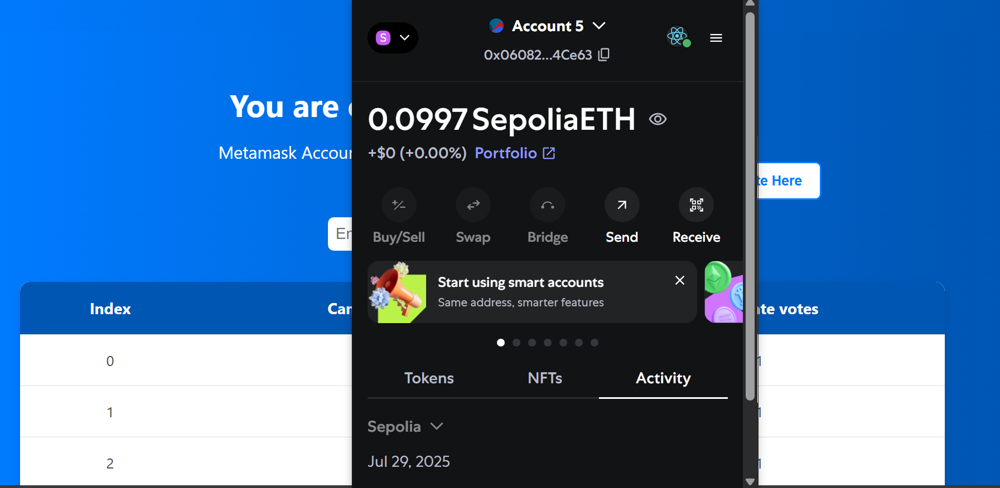

# 🗳️ Voting DApp

A fully decentralized voting application built using **React**, **Solidity**, and **Ethers.js**. Users can connect their MetaMask wallet, vote on proposals, and see real-time results stored securely on the Ethereum blockchain.

---

## 🌟 Features

- 🔐 Wallet connection using MetaMask
- 🧠 Create & display voting proposals
- ✅ Cast vote with one vote per account
- 🔗 Store vote records on the blockchain
- 📊 View real-time results from smart contract
- 🌍 Clean and responsive UI built with React

---

## 🧪 Tech Stack

| Layer       | Technology       |
|-------------|------------------|
| Frontend    | React, JavaScript |
| Blockchain  | Solidity, Hardhat |
| Interaction | Ethers.js, MetaMask|
| Network     | Localhost /  Sepolia |

---

## 💻 Demo Screenshots

### 👤 Wallet Connect  


### 🏠 Home Page  


### 🗳️ Voting Page  


### 📤 Transaction Confirmation  


### ✅ Connected Account  


---

## 🚀 Getting Started Locally

### 1. Clone the Repository

```bash
git clone https://github.com/iraghav898/voting-dapp.git
cd voting-dapp
